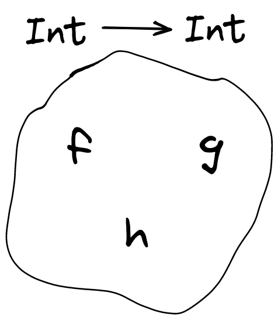

# Personal motivation

This is my small contribution to the effort (some would certainly call it the **sport**) of explaining what a **monad** is and how it can be used for the greater good.

More precisely, and pardon my shamelessness, this is an attempt at explaining it to **myself**. I just thought that it could be fun to bring along anyone else that would also like to think about this with me.

Another disclaimer should be made: I'm talking about **monads** as they appear in programming languages such as Haskell. I (unfortunately) still only have a very small clue about what a monad is in terms of **Category Theory**, but I will get there eventually as well!

Anyway, here is my attempt. If I am the only one coming out of this tutorial with a bit more clarity on the matter I will be happy. If anyone else gets something out of it as well I will be delighted. Any criticisms will make me ecstatic.

# The problem

First of all, we should understand the motivation for having those colorful friends (and, yes, I mean **monads**) in functional programming. How do they fit in with what functional programming brings to the world of software engineering?

It all has to do with complexity. We know this story all too well. Software is complex and it is getting more complex as more of the world is being brought into the digital realm. Computer programs integrate with an ever-increasing number of heterogeneous applications, databases, remote APIs, and all sorts of libraries and platforms.

All this complexity is overwhelming for us programmers. There is a limit to the number of moving parts a system can have before the programmer just shuts down and either freezes or starts to code blindly while hoping for the best. If those moving parts are heterogeneous between themselves with suboptimal interfaces and hidden side-effects - the perfect storm is upon us and we might as well just go home.

Something must be done.

# One solution

Remember how life was easy when we would just spend all our days playing with Lego? How all those Lego bricks would mount on each other, resulting in yet another, more complex brick, that would nonetheless allow for more bricks to be mounted on top? And could also be mounted on top of other bricks of a varying degree of complexity? It was our safe place. We could experiment at will knowing that we could always compose any two of our creations and - oh the excitement! - those Lego modules we would get for Christmas would perfectly fit with the ones we had been playing with all year!

The main theme here is **composability**: the kryptonite of complexity. This is also a theme in the history of the human endeavor for knowledge. Understanding is a double act of composition and decomposition. When we first thought about the atom, we thought of it as the ultimate, smallest, undivisible unit of reality. That meant there was nothing left to be known: an atom **was** an atom. Once we tried to understand its behavior, we eventually had to think about its properties - immediately a crack in its perfect atomicity was apparent. Conversely, we are all well aware that no software of any real complexity is written in one go - it is instead divided into modules, many of them prepackaged into libraries. In the end, we all hope, those modules will fit and we will have a working, intricate, digital system.

We must divide to conquer and we must be able to compose to defeat complexity.

## Monoids

Back to Lego! What if we think of our functions, our programs, as Lego bricks? Below, we have a playground with three functions. Each of them takes an `Int` and returns an `Int`. It doesn't matter what they do with the argument, it just matters that, whatever they do, an `Int` will come out of it after they're done with their computation.



What this means is that, no matter how we combine those function bricks, the resulting constructions all still belong in the same playground and can be combined with functions in that playground.

Composing `f` and `g` results in a new function that takes an `Int`, applies `g` to it and in turn, applies `f` to the result of `g` applied to the first `Int`. In Haskell, composition is denoted by the infix operator `.`, and we shall make use of it here as well.

In Haskell:

```haskell
f . g = \x -> f (g x) -- "\x -> ..." is a lambda expression, the equivalent of an arrow function in JS
```

In JavaScript, composing `f` with `g` results in having a new function `fCg`, such that `fCg = x => f(g(x))`

### For a more specific example


In Haskell:

```haskell
add1 = \x -> x + 1
add2 = \x -> x + 2
add3 = \x -> x + 3

add4 = add2 . add2
add7 = add3 . add1 . add1 . add2
add14 = add1 . add4 . add7 . add2
```

In JavaScript

```js
const add1 = x => x + 1;
const add2 = x => x + 2;
const add3 = x => x + 3;

const add4 = x => add2(add2(x));
const add7 = x => add3(add1(add1(add2(x))));
const add14 = x => add1(add4(add7(add2(x))));

// Note that we can also choose to implement the higher order function 'compose' ('.' in Haskell):

// In a curried...
const cComp = f => g => x => f(g(x));

const add5 = cComp(add3)(add2);
const add13 = cComp(add7)(cComp(add1)(add5));

// ...or uncurried fashion
const uComp = (f, g) => x => f(g(x));

const add6 = uComp(add3, add3);
const add8 = uComp(add3, uComp(add3, add2));
```

Notice that to get the `add14` function we composed functions that were themselves already the product of composability. What's notable is that we could go on forever doing this, having fun as if we were playing with Lego bricks.

This is what being a **monoid** means. Those functions of type `Int -> Int` are _closed under composition_: they can be indeterminately composed without ever being excluded from the playground.

Formally, a **monoid** is a bunch of things that have a binary, associative operation with an identity. Above, our operation is composition. It is associative because `add2 . (add2 . add1)` is the same as `(add2 . add2) . add1`. And its identity is the function that 'transparently' spits out the `Int` that is passed to it: `const id = x => x`, which means: `add1(id(x)) = id(add1(x)) = add1(x).`

Note: I have chosen to specialize our example to functions of type `Int -> Int`, but it can be generalized to functions from any type to the same type: `a -> a` (`a` here denotes a type variable)

## Monads

Programs, though, as we know, are not as pure as our previous naive example. The purpose of software is to impact the world, to do useful stuff. And, as we also know all too well, when stuff gets done, **shit happens**.

Moving to the realm of effects, system calls and API requests, let's imagine a new playground with functions very similar to the ones above but with a very important distinction: they can **fail**.

For the purpose of our example, the semantics of failure and success will be the following:

-   a **failed** computation returns an empty list (`[]`);
-   a **successful** computation returns a singleton list with the computed value (e.g. `[42]`).

Thus, in our new playground all our functions now have type `Int -> [Int]`, reflecting the possibility of failure.


Suddenly, when we try to play with our Lego bricks, we realize they are broken. They don't compose anymore!

See it for yourself: applying `madd1` to `41` will always get us a list. Whether it is empty or not depends on the implementation of `madd1` and on factors from the external world. Let's pretend that adding `1` depends on a call to a database. If it fails, it returns `[]`, and if it succeeds it returns `[42]`. Either way, we can't take this returned value, a list, and feed it to `madd2`, or to any of our functions, for that matter, for they are all expecting an `Int`.

It begs the question: How can we make our playground fun again, how can we make it a **monoid**? That is, how can we compose any two functions such that our resulting function also belongs in the same playground?

### map

Let's first take a look into `map`.

Any programmer with at least a passing experience with functional programming has made use of the `map` function.

`map` is a higher-order function that takes a function `f` and some 'container' of values, and then returns the intact container with its values transformed by the application of `f` to each one of them.

Specializing `map` to lists (or Arrays for JavaScript programmers), we can write its type as `(a -> b) -> [a] -> [b]`. `(a -> b)` is the type of the function `f`, `[a]` is the type of the input list or array, and `[b]` is the type of the output list with its elements resulting from the application of `f` to every `a` element of the original list (`f` transforms `a` elements into `b` elements).

Perhaps it is not yet obvious why are we taking what seems a detour into `map`. Remember when we first defined composition? `f` composed with `g` means we want to apply `f` to the result of applying `g` to some value. In our playground, `madd1` returns a list of type `[Int]`. And `madd2` takes a value of type `Int`. This means we can map `madd2` over the result of applying `madd1` to some value. The only special thing here, is that our `[Int]` value is a singleton list or array. Therefore mapping over it means applying a function to the value contained in that list!

Our new `compose` function would then be:

Haskell:

```haskell
compose f g x = map f (g x)

madd3 = compose madd2 madd1
```

JavaScript:

```js
const compose = (f, g) => x => g(x).map(f);

const madd3 = compose(madd2, madd1);
```

But this is not the end of the story!

Let's apply our new composed function `madd3` to the value `1`, and suppose no function fails when performing their computation:

Haskell:

```haskell
result = madd3 1 -- [[4]]
```

JavaScript:

```js
const result = madd3(1); // [[4]]
```

We needed an output of type `[Int]`, not of type `[[Int]]`! Our Legos still don't compose!

As it is, our `compose` function has type `(Int -> [Int]) -> (Int -> [Int]) -> (Int -> [[Int]])`.

Our desired type is `(Int -> [Int]) -> (Int -> [Int]) -> (Int -> [Int])`.

### flat

What we miss then is a function of type `[[a]] -> [a]`. We might know it as `concat` in Haskell, or `flat` in JavaScript. Regardless of the name, we need a function that 'peels' one structural layer and, given a list `[[x]]`, returns `[x]`.

### flatMap

In other words, we need to be able to implement a higher-order function that combines `map` and `flat`.

Provided we can implement such a function (and another we will see when we look at the monad laws) for our lists, arrays or, more generally, for any 'container' type, we have turned that type into a **monad**.

Both Haskell and JavaScript already provide implementations for, respectively, lists and arrays. In Haskell that would be `(=<<)` (specialised to lists, as it is overloaded), and in JavaScript `Array.prototype.flatMap()`.

Let's see it in action:

Haskell:

```haskell
compose f g x = f =<< g x

madd3 = compose madd2 madd1
madd5 = compose madd3 madd2
madd9 = compose madd3 (compose madd5 madd1)

resultA = madd3 1 -- [4]
resultB = madd5 1 -- [6]
resultC = madd9 1 -- [10]
```

JavaScript:

```js
const compose = (f, g) => x => g(x).flatMap(f);

const madd3 = compose(madd2, madd1);
const madd5 = compose(madd3, madd2);
const madd9 = compose(madd3, compose(madd5, madd1));

const resultA = madd3(1); // [4]
const resultB = madd5(1); // [6]
const resultC = madd9(1); // [10]
```

In practice, we would not write a `compose` function most of the time, but just sequence our functions:

Haskell:

```haskell
madd3 x = madd2 =<< madd1 x
madd5 x = madd3 =<< madd2 x
madd9 x = madd3 =<< madd5 =<< madd1 x

-- or, more commonly:

madd3 x = madd1 x >>= madd2 -- (>>=) is the same has (=<<) but with the parameters flipped
madd5 x = madd2 x >>= madd3
madd9 x = madd1 x >>= madd5 >>= madd3

-- more explicitly:
madd9 = \x -> madd1 x >>= madd5 >>= madd3

resultA = madd3 1 -- [4]
resultB = madd5 1 -- [6]
resultC = madd9 1 -- [10]
```

See how we are back to our **monoid** playground? We have found a way to compose our new functions just as we started by composing the ones in our first playground.

With this, we have unleashed the power of the **monad**! Remember: **composability allows us to address complexity!** We can now combine ever more complex structures until we have our final, majestic Millennium Falcon, Notre Dame, or whatever Lego design we have in our (or our client's) minds!

### Monad laws

Formally, just like for our first monoid, if we want to have a fully composable monad, the `flatMap` operation also needs to obey the rules of associativity and identity. For this we need to implement another function named `return` in Haskell, with a pretty simple implementation for the case of our particular monad. Because `return` is a keyword in JavaScript, let's call it `toMonad`. What it does is taking a pure, plain value, and applying to it a layer of monadic structure, that is, _lifting_ it to the type of our monad:

Haskell

```haskell
toMonad x = [x]
```

JavaScript

```js
const toMonad = x => [x];
```

Haskell

```haskell
(toMonad x) >>= f = f x -- left identity
mx >>= toMonad = mx -- right identity
(mx >>= f) >>= g = mx >>= (\x -> (f x >>= g)) -- associativity
```

JavaScript

```js
toMonad(x).flatMap(f) = f(x) // left identity
mx.flatMap(toMonad) = mx // right identity
mx.flatMap(f).flatMap(g) = mx.flatMap(x => (f(x).flatMap(g))) // associativity
```

# Wrapping up

It is important to draw attention to the fact that I said very little about the implementation of `(>>=)` or `flatMap`. Indeed, that operation needs to be specifically tailored to the type of container we want to turn into a `monad`.

In JavaScript, for example, `flatMap` is already implemented for arrays, but nothing prevents us from writing our own _flatMaps_ for other types (or classes, more appropriately) we create. If we do, we can call them `bind`, as `(>>=)` is called in Haskell. By the way, in the playground that we created above, what happens when one of the computations in a sequence fails? Does it get ignored? Do they all fail?

Just as a final word, don't be stuck into thinking monads only exist to handle failure. Many kinds of monads exist and more can be created, another notable one being the State monad, for avoiding shared mutable state by allowing composition of functions of the type `State -> (Value, State)`.

In the end, I hope I have gotten **monads** at least partially right. A lot in my examples and explanation is simplified, both because I lack the knowledge to do better and also because I chose not to overwhelm. This is perhaps the advantage of writing a tutorial so close in time to my own 'aha!' moment, even though I already had the intuition for how to use them. Nothing like trying to explain in order to learn.

## Further reading

[Youtube: Brian Beckman - Don't Fear The Monad](https://www.youtube.com/watch?v=ZhuHCtR3xq8)

[HaskellWiki - All About Monads](https://wiki.haskell.org/All_About_Monads)

[Graham Hutton - Programming in Haskell](https://www.cs.nott.ac.uk/~pszgmh/pih.html)
